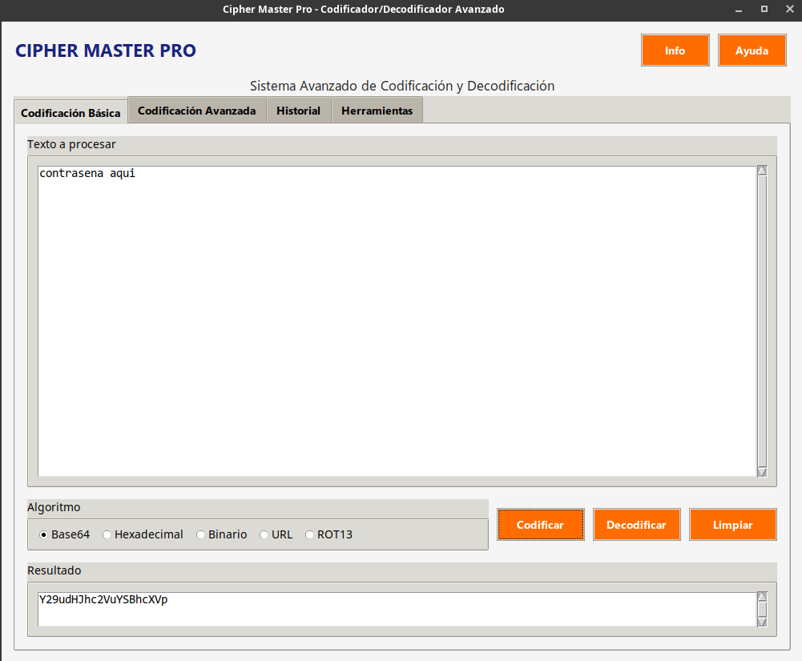

# coder11:11
# Cipher Master Pro 🚀



**Cipher Master Pro** es una aplicación avanzada de codificación/decodificación con múltiples algoritmos y herramientas de seguridad.

## Características principales

- 🔒 **Codificación básica**: Base64, Hexadecimal, Binario, URL, ROT13
- 🛡️ **Codificación avanzada**: AES, MD5, SHA-1, SHA-256, Compresión
- 📚 **Historial completo**: Registro de todas las operaciones con búsqueda
- 🛠️ **Herramientas adicionales**:
  - Generador de contraseñas seguras
  - Analizador de texto (detecta emails, URLs, IPs)
- 📋 **Funciones útiles**:
  - Copiar al portapapeles
  - Guardar resultados en archivo
  - Deshacer/rehacer operaciones

## Requisitos del sistema

- Python 3.8+
- Dependencias (instaladas automáticamente):

```bash
pip install -r requirements.txt
